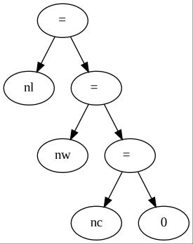
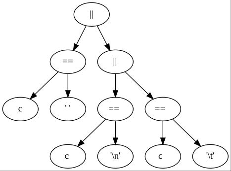
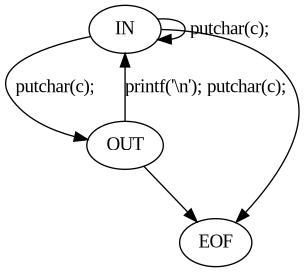

# Maquinas de Estado -- Palabras en Lineas

## Arboles de expresion

### Conteo de Palabras

```C
#include <stdio.h>
#define IN 1
#define OUT 0

main(){
    int c, nl, nw, nc, state;
    state = OUT;
    nl = nw =nc =0;
    while ((c=getchar())!= EOF){
        ++nc;
        if(c=='\n')
            ++nl;
        if(c == ' ' || c == '\n' || c == '\t')
            state = OUT;
        else if (state ==OUT){
            state=IN;
            ++nw;
        }
    }
    printf("%d %d %d\n", nl, nw, nc);
}
```
## Respuestas

### 1
#### b


#### c



### 2
#### a


#### b

5-upla de la siguiente manera  (Q, Σ, T, q0, F),

* Q es un conjunto finito no vacío de estados {OUT, IN, EOF},
* Σ es el alfabeto de caracteres reconocidos por la máquina de estados (Todos los caracteres que acepte el lenguaje C),
* q0 ∈ Q es el estado inicial {IN},
* F ∈ Q es el conjunto no vacío de estados finales (EOF)
* T: Q x Σ -> Q es la función de transiciones, es decir: T (q, x) = z significa que z es el estado al
cual transita la máquina de estados desde el estado q, al leer el carácter x.


### 3
#### a
```C
#include <stdio.h>
main(){
    typedef enum state {OUT, IN} state;
    int c, nl, nw, nc;
    state State = OUT;
    nl = nw =nc =0;
    while ((c=getchar())!= EOF){
        ++nc;
        switch (State){
            case OUT:
                State=IN;
                ++nw;
                break;
            case IN:
                if(c=='\n')
                    ++nl;
                if(c == ' ' || c == '\n' || c == '\t')
                    State = OUT;
                break;
        }
    }
    printf("%d %d %d\n", nl, nw, nc);
}
```
La ventaja de esta versión es que es mas explicita la maquina de estados y es mas facil su construccion.
La principal desventaja es que es menos eficiente ya que genera una copia del objeto a comparar

#### b

```C
#include<stdio.h>
int main(){
    int c, nl, nw, nc;
    nl = nw =nc =0;
    WHILE:
        if ((c=getchar())!= EOF)
            goto IN;
    printf("%d %d %d\n", nl, nw, nc);
    return 0;
    OUT:
        ++nw;
        goto WHILE;
    IN:
        ++nc; 
        if(c=='\n')
            ++nl;
        if(c == ' ' || c == '\n' || c == '\t')
            goto OUT;
        goto WHILE;
}
```

#### iv
Hoy en dia no es muy comun el uso de goto pero se puede encontrar en lenguajes como C# y existen implementaciones de labels y goto en javascript

