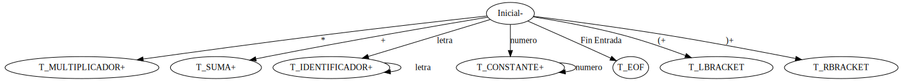

### 1. Nivel lexico

Para el nivel léxico se generó una máquina de estado y una gramática léxica, para identificar los tokens y lexemas válidos para el LP

Para la implementación del nivel léxico, se desarrollo un `Scanner`, que toma los caracteres del stdin con la función `getchar()`, y expone tokens válidos mediande la función `GetNextToken()`

Los caracteres se almacenan en una variable entera ya que son una representacion numerica en ascii

Se entiende por token a toda categoria lexica de nuestro lenguaje de programacion

Se entiende por lexema a todo elemento que compone el lenguaje regular. 

Por ejemplo: A=2. "A", "=" y "2" son lexemas y Constante, asignacion y evaluacion son los respectivos tokens.

El valor semantico de los tokens es almacenado en un buffer global llamado lexema que al final contiene un \0

Expresiones regulares: expresion que describe un conjunto de cadenas: todas aquellas que son palabras del LR que la ER representra. definen lenguaje formales y se usa para reconocer los tokens del lenguaje de programacion

Para resolver el tema de los espacios se corrobora si el caracter ingresado es un espacio y en caso verdadero se vuelve a invocar a la funcion GetNextToken


### Maquina de Estado


**Categorias Lexicas**
- Constante.
- Identificador.
- Suma.
- Multiplicacion
- asignacion
- evaluacion

**Gramática léxica BNF**
```
<token> ::=  <identificador> | <constante> | <suma> | <multiplicación> | <evaluacion> | <asignacion> 
<constante> ::= <dígito> | <constante> <dígito>
<dígito> ::= 0 | 1 | 2 | 3 | 4 | 5 | 6 | 7 | 8 | 9
<identificador> ::= <letra> | <identificador> <letra>
<letra> ::= a | b | c | d | e | f | g | h | i | j | k | l | m | n | o | p | q | r | s | t | u | v | w | x | y | z | A | B | C | D | E | F | G | H | I |J | K | L | M | N | O | P | Q | R | S | T | U | V | W | X | Y | Z
<suma> ::= +
<multiplicacion> ::= *
<asignacion> ::= =
<evaluacion> ::= $
```

### 2. Nivel sintactico


Se usa la tecnica de Analisis Sintactico Descendente Recursivo, la cual se implementa por rutinas que se invocan de forma recursiva construyendo el analisis sintactico. 

Cada funcion se llama Procedimiento de Analisis Sintactico (PAS). A cada variable le corresponde una funcion.

Es recursivo porque son rutinas que se pueden invocar a si mismas

Cada PAS reduce la expresion a un valor entero y resuelve la prescedencia de operadores. En el ultimo nivel tengo el factor que resuelve la multiplicacion.  La suma esta al nivel de una expresion, mas abajo vienen los terminos (factor) y los factores(parentesis):

- parser(): Metodo expuesto, llama a programa 
- programa(): llama a listaSentencia y valida que se ingrese el token FDT
- listaSentencia(): invoca a la función sentencia() y en caso de que haya mas sentencias vuelve a invocar a sentencia()
- sentencia(): Busca una sentencia de asignacion o evaluacion y guarda el identificador con su valor en la tabla de simbolos o evalua la expresion respectivamente
- expresión(): devuelve el resultado devuelto por el término, sumado al valor recursivo de llamar al PAS expresión
- término(): devuelve el resultado devuelto por el factor, multiplicado por el valor recursivo de llamar al PAS término
- factor(): el valor numérico de la constante, o el valor asociado al identificador, o el resultado de una expresión entre paréntesis
- match(): invoca a la función del Scanner `GetNextToken()`, si el valor no coincide con el esperado se produce un error sintáctico y se aborta el programa

**Categorias Sintacticas**
- Programa
- listaSentencias
- sentencia
- Expresion
- Termino
- Factor

**Gramatica sintactica BNF**
```
<parser> ::=  <programa>
<programa> ::=  <listaSentencias> FDT
<listaSentencias> ::=  <sentencia> | <listaSentencias> <sentencia>
<sentencia> ::= <identificador> <asignacion> <constante>  |  <evaluacion> <expresión> 
<expresión> ::=  <término> | <expresión> <suma> <término>
<término> ::= <factor> |  <factor> <multiplicacion> <término>
<factor> ::= <constante> | <identificador> | ( <expresión> ) 
```


