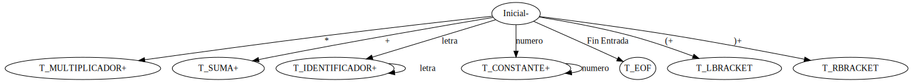

### 1. Nivel lexico

Para esta iteracion se dessarrollo el scanner con la herramienta Lex

Dada una ER se identifican los lexemas y se asocian con un token valido para el LP

Se logra mantener la misma interfaz gracias a la implementacion de la funcion GetNextToken que wrapea la funcion yylex(). Del mismo modo, se realiza una copia de la variable yytext en el buffer global lexema y se puede mantener el funcionamiento de la tabla de simbolos

### Maquina de Estado


**Categorias Lexicas**
- Constante.
- Identificador.
- Suma.
- Multiplicacion
- asignacion
- evaluacion

**Gramática léxica**
```
<token> ::=  <identificador> | <constante> | <suma> | <multiplicación> | <evaluacion> | <asignacion> 
<constante> ::= <dígito> | <constante> <dígito>
<dígito> ::= 0 | 1 | 2 | 3 | 4 | 5 | 6 | 7 | 8 | 9
<identificador> ::= <letra> | <identificador> <letra>
<letra> ::= a | b | c | d | e | f | g | h | i | j | k | l | m | n | o | p | q | r | s | t | u | v | w | x | y | z
<suma> ::= +
<multiplicacion> ::= *
<asignacion> ::= =
<evaluacion> ::= $
```

### 2. Nivel sintactico

El parser se desarrollo con la herramienta Bison.

La funcion parser() permite mantener la compatibilidad con calc.c ya que wrapea a la funcion yyparse() de bison. 

Se reimplementa en parser.y la funcion yylex que wrapea a la funcion GetNextToken definida en scanner.l

Para la gramatica definida se utiliza recursividad a izquierda

Adicionalmente se utiliza la directiva union de Bison que permite definir el valor semantico que tiene cada una de la rutinas. La union contiene un campo para cada tipo de valor semantico. En la variable yylval Lex le pasa a Bison los valores semanticos

**Categorias Sintacticas**
- Parser
- Programa
- listaSentencias
- sentencia
- Expresion
- Termino
- Factor

**Gramatica sintactica en BNF**
```
<parser> ::=  <programa>
<programa> ::=  <listaSentencias> FDT
<listaSentencias> ::=  <sentencia> | <listaSentencias> <sentencia>
<sentencia> ::= <identificador> <asignacion> <constante>  |  <evaluacion> <expresión> 
<expresión> ::=  <término> | <expresión> <suma> <término>
<término> ::= <factor> |  <factor> <multiplicacion> <término>
<factor> ::= <constante> | <identificador> | ( <expresión> ) 
```